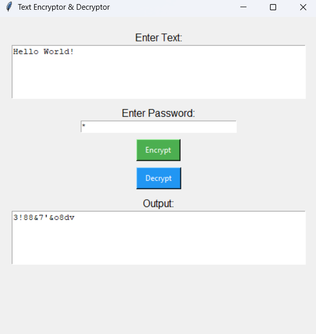

# 🔐 Encryption & Decryption Tool (Python + Tkinter GUI)


A simple and fun encryption/decryption app built using Python and Tkinter.  
This tool scrambles your text based on a password and lets you securely encrypt or decrypt messages with ease.

---

## 🚀 Features

- ✅ Encrypt any plain text using a password
- ✅ Decrypt the text back using the same password
- ✅ GUI-based — no terminal needed
- ✅ Supports all characters (letters, numbers, symbols, spaces)
- ✅ Beginner-friendly code structure

---

## 🖼️ App Preview

> ## 🖼️ App Preview



---

## 📦 Requirements

- Python 3.x
- Tkinter (comes pre-installed with Python)

---

## 🛠️ How to Run It

1. Clone the repo or download the `.py` file
2. Open terminal and navigate to the project folder
3. Run the app:

```bash
python Encryption_Decryption.py
```
## License

This project is licensed under the [MIT License](https://opensource.org/licenses/MIT) © 2025 Dev.  
Feel free to use, modify, and distribute it for personal or commercial use.
